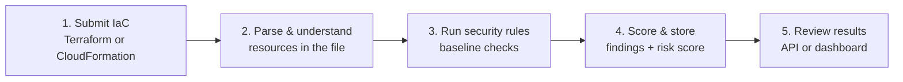
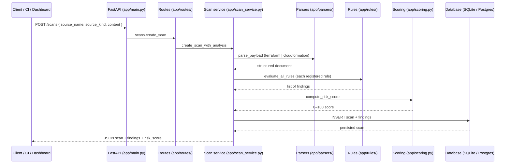
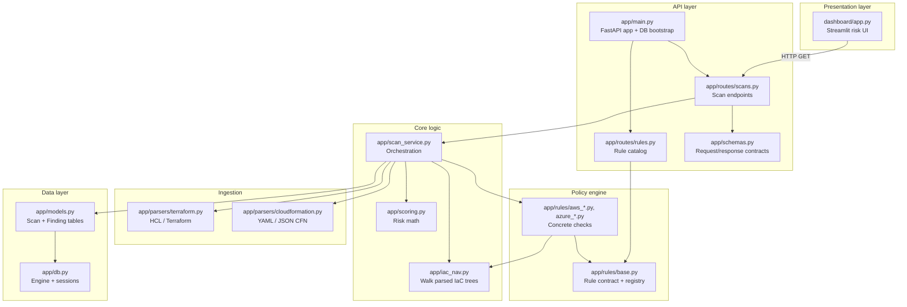
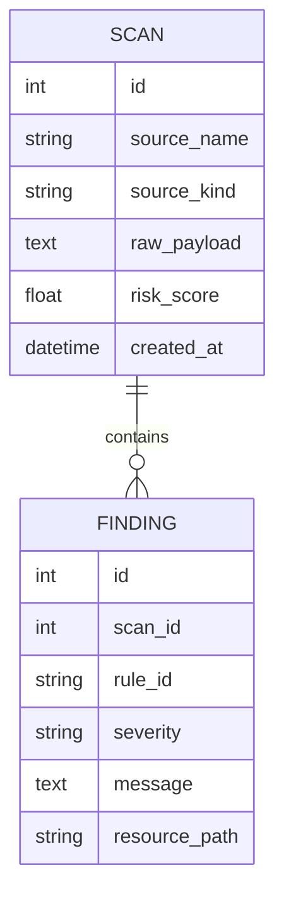
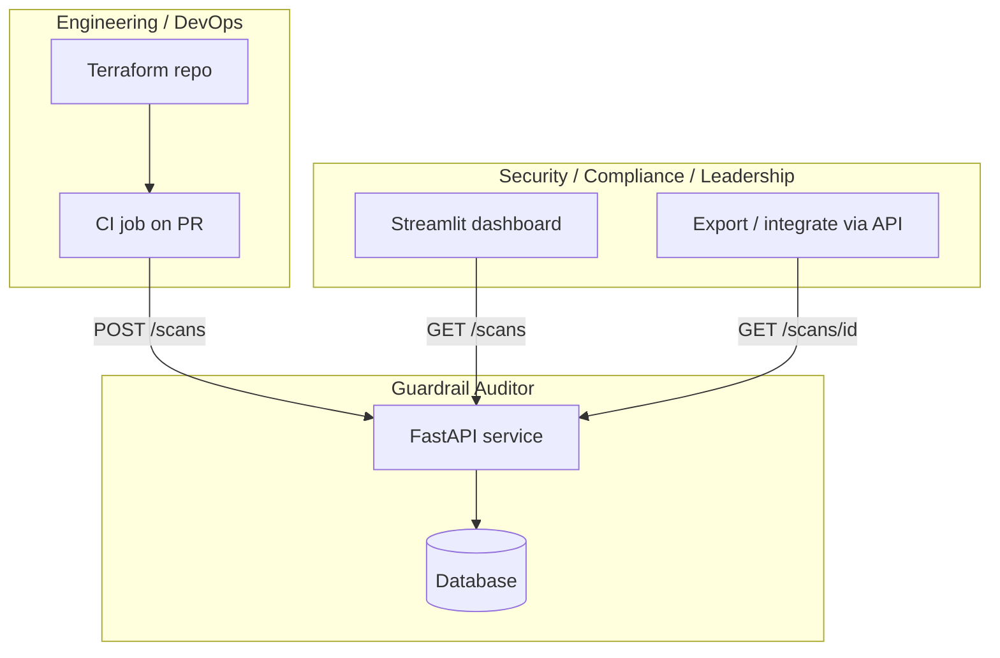

# Enterprise Security Guardrail Auditor  
## Stakeholder overview — how it works

**Audience:** business, compliance, security, and engineering  
**Product:** automated review of infrastructure-as-code (IaC) before or after deployment  
**Formats supported today:** Terraform (`.tf`) and AWS CloudFormation (`.yaml` / JSON)

---

## 1. What problem does this solve?

Teams define cloud infrastructure in **configuration files** (Terraform, CloudFormation). Misconfigurations—such as a **public data bucket** or **SSH open to the internet**—create compliance and breach risk.

The **Guardrail Auditor** acts like a **compliance checkpoint**:

| Business need | What the product does |
|---------------|------------------------|
| Catch risky patterns early | Scans IaC text against a **security baseline** (rules). |
| Prioritize remediation | Produces a **Risk Score (0–100)** and a list of **findings** with severity. |
| Audit trail | Stores each scan and its results in a **database** for later review. |
| Integrate with tools | Exposes an **API-first** interface (CI/CD, scripts, dashboards). |
| Executive visibility | **Streamlit dashboard** charts risk across scans. |

**In one sentence:** *Upload infrastructure code → get a scored compliance report with specific issues to fix.*

---

## 2. End-to-end execution flow

### Business view (five steps)

| Step | What happens | Who cares |
|------|----------------|-----------|
| **1. Submit** | A client sends the raw file content plus metadata (`source_name`, `source_kind`). | CI pipeline, security team, or dashboard operator. |
| **2. Parse** | The system reads the file structure (buckets, security groups, IAM policies, etc.). | Engineering — ensures the scanner “understands” the template. |
| **3. Evaluate** | Each **rule** checks for a known bad pattern (e.g. public S3 ACL). | Compliance / security — maps to control objectives. |
| **4. Score & persist** | Findings are saved; a **Risk Score** is calculated and stored with the scan. | Risk owners — compare scans over time. |
| **5. Review** | Results are retrieved via **REST API** or the **Streamlit dashboard**. | Leadership and operators — visual trend + drill-down. |

### Technical view (request path)

### API entry points (today)

| Endpoint | Purpose |
|----------|---------|
| `GET /health` | Liveness check for monitoring. |
| `POST /scans` | Run a full scan and persist results. |
| `GET /scans` | List recent scans with summary (including finding count). |
| `GET /scans/{id}` | Full detail for one scan. |
| `GET /rules` | Catalog of active baseline rules (transparency for auditors). |

---

## 3. Risk score — business explanation

The **Risk Score** is a **weighted sum** of finding severities, capped at **100**.

| Severity | Weight (points) | Typical meaning |
|----------|-----------------|-----------------|
| Critical | 25 | Immediate exposure (e.g. admin IAM wildcard, SSH from internet). |
| High | 15 | Serious misconfiguration (e.g. public S3 ACL). |
| Medium | 8 | Should be fixed in next cycle. |
| Low | 3 | Minor deviation. |
| Info | 1 | Informational note. |

**Example (from sample fixtures):**

| File | Findings | Risk score | Interpretation |
|------|----------|------------|----------------|
| `fixtures/insecure_aws.tf` | 3 | **65** | Multiple high/critical issues — prioritize remediation. |
| `fixtures/secure_aws.tf` | 0 | **0** | Clean against current baseline. |
| `fixtures/insecure.cfn.yaml` | 2 | **40** | CloudFormation with public bucket + open SSH pattern. |
| `fixtures/insecure_azure.tf` | 2 | **40** | Azure storage + NSG exposure patterns. |

*The score is a **prioritization aid**, not a certification. Policy teams can tune weights in `app/scoring.py`.*

---

## 4. Security baseline (rules) — plain language

Each rule is a **single compliance check**. Rules live under `app/rules/` and self-register via `app/rules/base.py`.

| Rule ID | Provider | Business concern | Technical check |
|---------|----------|------------------|-----------------|
| `aws.s3.public_access` | AWS | Data leak / regulatory exposure | Public S3 ACLs; disabled public-access block settings (Terraform + CloudFormation). |
| `aws.network.sg_ingress_0_0_0_0` | AWS | Unauthorized network access | Security groups allowing `0.0.0.0/0` on sensitive ports (SSH, RDP, common DB ports). |
| `aws.iam.wildcard_admin` | AWS | Privilege escalation | IAM inline policies with `Allow`, `Action: *`, `Resource: *`. |
| `azure.storage.https_only` | Azure | Data in transit | Storage account with HTTPS-only disabled. |
| `azure.network.nsg_open_inbound` | Azure | Perimeter breach | NSG inbound Allow from internet to SSH/RDP (or `*`). |

**Extensibility:** new rules = new file in `app/rules/` + register decorator — no change to API contract.

---

## 5. Code map — parts and responsibilities

### Layer diagram

### Responsibility matrix

| Component | Path | Responsibility | Stakeholder lens |
|-----------|------|----------------|------------------|
| **API gateway** | `app/main.py` | Starts the service; creates DB tables on startup; mounts routes. | “The front door.” |
| **Scan API** | `app/routes/scans.py` | Accepts scans, returns lists and details; maps errors to HTTP status. | “Submit and retrieve audit results.” |
| **Rules API** | `app/routes/rules.py` | Lists which controls are active. | “What baseline are we enforcing?” |
| **Contracts** | `app/schemas.py` | Validates JSON shape (`source_kind`, `content`, etc.). | “Data quality at the boundary.” |
| **Orchestrator** | `app/scan_service.py` | Parse → evaluate → score → save; single place for scan workflow. | “The audit pipeline.” |
| **Terraform parser** | `app/parsers/terraform.py` | Turns `.tf` text into a structure rules can read. | “Reads Terraform.” |
| **CloudFormation parser** | `app/parsers/cloudformation.py` | Turns YAML/JSON templates into a structure. | “Reads CloudFormation.” |
| **IaC navigator** | `app/iac_nav.py` | Normalizes parser output; walks resources; helpers (booleans, IAM JSON). | “Makes different file formats comparable.” |
| **Rule framework** | `app/rules/base.py` | Defines `Rule`, `RuleFinding`, registry. | “Plugin model for compliance checks.” |
| **Rule implementations** | `app/rules/aws_*.py`, `azure_*.py` | Each file = one or more specific controls. | “The actual guardrails.” |
| **Scoring** | `app/scoring.py` | Converts findings → 0–100 score. | “Executive rollup metric.” |
| **Database access** | `app/db.py` | Connection URL (`DATABASE_URL`), sessions; SQLite default, Postgres-ready. | “Audit retention.” |
| **Persistence model** | `app/models.py` | `Scan` (metadata + score) and `Finding` (per-issue rows). | “Evidence store.” |
| **Dashboard** | `dashboard/app.py` | Calls API; bar chart of scores; finding table. | “Management view.” |
| **Sample IaC** | `fixtures/*` | Known good/bad templates for demos and tests. | “Proof the baseline works.” |
| **Automated tests** | `tests/*` | Unit, rule, and API tests; in-memory DB for CI. | “Regression safety net.” |

---

## 6. Data model (what gets stored)

| Field | Business meaning |
|-------|------------------|
| `source_name` | Label for the file or pipeline job (e.g. `prod-vpc.tf`). |
| `source_kind` | `terraform` or `cloudformation`. |
| `raw_payload` | Full submitted content (for replay / forensics). |
| `risk_score` | Rollup priority metric for that scan. |
| `rule_id` | Which baseline rule fired. |
| `severity` | critical / high / medium / low / info. |
| `message` | Human-readable explanation. |
| `resource_path` | Where in the template the issue was found. |

**Default database:** SQLite file `guardrail.db` (zero cost, local). Production can set `DATABASE_URL` to PostgreSQL or another supported SQLAlchemy backend.

---

## 7. How teams typically use it

| Role | Typical action |
|------|----------------|
| **Developer** | Pipeline posts changed `.tf` / `.yaml` on each PR; fails build if score exceeds threshold (future gate). |
| **Security analyst** | Reviews findings via API or dashboard; maps `rule_id` to control frameworks. |
| **Compliance** | Uses stored scans as evidence of configuration review. |
| **Leadership** | Uses dashboard risk chart to see trend across services or environments. |

---

## 8. Configuration parameters

| Parameter | Where set | Effect |
|-----------|-----------|--------|
| `DATABASE_URL` | Environment / `app/db.py` | Database connection (default SQLite). |
| `GUARDRAIL_API_URL` | Environment / `dashboard/app.py` | API base URL for the dashboard (default `http://127.0.0.1:8000`). |
| `source_kind` | `POST /scans` body | `terraform` or `cloudformation` — selects parser. |
| `source_name` | `POST /scans` body | Display name for the scan. |
| `content` | `POST /scans` body | Full IaC file text to analyze. |

---

## 9. Quality assurance (how we know it works)

| Layer | Location | What it proves |
|-------|----------|----------------|
| Scoring math | `tests/test_scoring.py` | Risk weights and cap behave correctly. |
| Rules on fixtures | `tests/test_rules_fixtures.py` | Insecure samples flag expected rules; secure sample stays clean. |
| HTTP API | `tests/test_api.py` | Health, rule list, scan create/list/get, parse errors return 400. |

Latest recorded run: **12 tests passed** — see **Code execution log** in `README.md`.

---

## 10. Glossary

| Term | Meaning |
|------|---------|
| **IaC** | Infrastructure as Code — machine-readable templates that define cloud resources. |
| **Terraform** | HashiCorp language/tooling (`.tf` files). |
| **CloudFormation** | AWS-native template format (YAML/JSON). |
| **Finding** | One recorded violation of a rule. |
| **Rule / guardrail** | A single automated compliance check. |
| **Risk score** | Weighted rollup of findings (0 = clean, 100 = maximum modeled risk). |
| **API-first** | Core capability is exposed as HTTP APIs; UI is a consumer, not the only interface. |

---

*Document version: aligned with MVP codebase in `guardrail-auditor/` (May 2026).*
